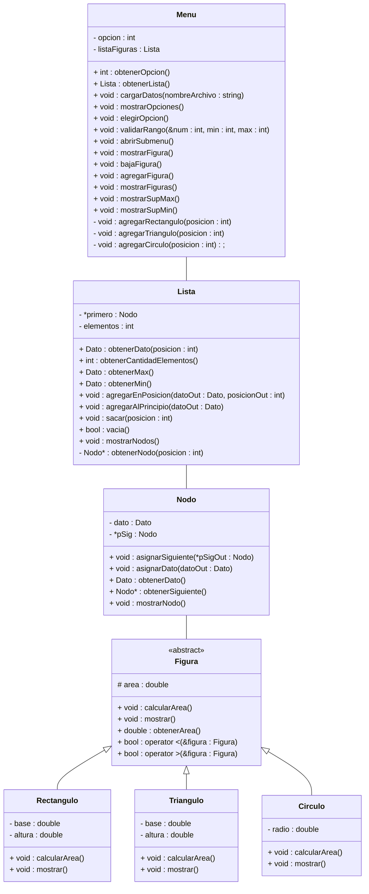

```mermaid
classDiagram

class Figura {
    <<abstract>> 
    # area : double
    + void : calcularArea()
    + void : mostrar()
    + double : obtenerArea()
    + bool : operator < (&figura : Figura)
    + bool : operator > (&figura : Figura)
}

class Rectangulo {
	- base : double
	- altura : double
	+ void : calcularArea()
	+ void : mostrar()
}

class Triangulo {
	- base : double
	- altura : double
	+ void : calcularArea()
	+ void : mostrar()
	
}

class Circulo {
	- radio : double
	+ void : calcularArea()
	+ void : mostrar()
}

class Nodo {
	- dato : Dato
	- *pSig : Nodo
	+ void : asignarSiguiente(*pSigOut : Nodo)
	+ void : asignarDato(datoOut : Dato)
	+ Dato : obtenerDato()
	+ Nodo* : obtenerSiguiente()
	+ void : mostrarNodo()
}

class Lista {
	- *primero : Nodo
	- elementos : int
	+ Dato : obtenerDato(posicion : int)
	+ int : obtenerCantidadElementos()
	+ Dato : obtenerMax()
	+ Dato : obtenerMin()
	+ void : agregarEnPosicion(datoOut : Dato, posicionOut : int)
	+ void : agregarAlPrincipio(datoOut : Dato)
	+ void : sacar(posicion : int)
	+ bool : vacia()
	+ void : mostrarNodos()
	- Nodo* : obtenerNodo(posicion : int)
}

class Menu {
	- opcion : int
	- listaFiguras : Lista
	+ int : obtenerOpcion()
	+ Lista : obtenerLista()
	+ void : cargarDatos(nombreArchivo : string)
	+ void : mostrarOpciones()
	+ void : elegirOpcion()
	+ void : validarRango(&num : int, min : int, max : int)
	+ void : abrirSubmenu()
	+ void : mostrarFigura()
	+ void : bajaFigura()
    + void : agregarFigura()
    + void : mostrarFiguras()
    + void : mostrarSupMax()
    + void : mostrarSupMin()
    - void : agregarRectangulo(posicion : int)
    - void : agregarTriangulo(posicion : int)
    - void : agregarCirculo(posicion : int);
}

Menu -- Lista
Lista -- Nodo
Nodo -- Figura

Figura <|-- Rectangulo
Figura <|-- Triangulo
Figura <|-- Circulo
```

